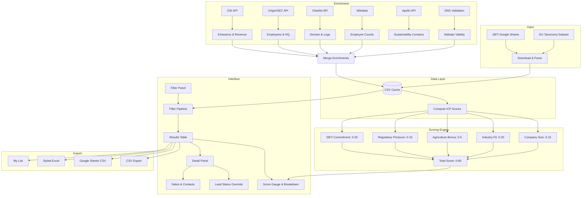

# Terrascope ICP Lead Finder

A desktop application that scores over 15,000 companies from the SBTi database against Terrascope's Ideal Customer Profile, enriches them with real-world data from multiple sources, and provides a complete workflow for filtering, evaluating, and exporting leads.

---

## What This Tool Does

The SBTi (Science Based Targets initiative) publishes a public database of companies that have committed to setting climate targets. This is a rich dataset, but it is raw -- it gives you names, industries, and statuses, but tells you nothing about which companies actually fit your business.

This tool ingests that dataset and transforms it into a lead pipeline. It scores every company against an Ideal Customer Profile so you can immediately see which prospects are worth pursuing, which are borderline, and which are not a fit. It enriches the data with employee counts, revenue, emissions, website validity, and contact information. It lets you slice the data by any combination of filters, save companies to a persistent list, export to multiple formats, and search for sustainability contacts.

The goal is to turn a public spreadsheet into a working sales pipeline with minimal manual effort.

---

## How It Works



---

## Quick Start

```
pip install customtkinter pandas requests openpyxl
python main.py
```

The first run will prompt you to download the SBTi database. After the download completes, scores are computed automatically and the full dataset appears in the table.

---

## The Scoring Model

The ICP score is designed to reflect genuine fit rather than inflated metrics. Every point must be earned through measurable characteristics.

### What changed from the original model

The original scoring had two problems. First, every company that was not in an excluded industry received 20 free points for passing a check that required no effort. Second, SBTi commitment was counted twice -- once in the regulatory category and once as its own category. This inflated scores artificially and made it hard to distinguish strong leads from weak ones.

The current model removed those free points entirely. The maximum possible score is 80, and every point must come from a real signal.

### Score Components

| Component | Maximum | What It Measures |
|-----------|---------|------------------|
| Company Size | 15 | Established companies with 200 or more employees score the full amount. Smaller companies score zero. This is a binary check, not a sliding scale, because the question is whether the company has enough organizational scale to purchase your solution. |
| Industry Fit | 20 | Companies in high-fit industries (food, agriculture, retail, manufacturing, logistics, consumer goods, fashion, packaging, food and beverage) score 20. Medium-fit industries (real estate, healthcare, technology, energy, utilities, chemicals) score 12. All others score 5. |
| Agriculture Bonus | 5 | Companies specifically in agriculture or farming receive an additional 5 points. This reflects a strategic priority on the agricultural supply chain. |
| Regulatory Pressure | 15 | Companies headquartered in EU countries score 15. Regulatory mandates like CSRD create a compliance-driven need that makes these companies more likely to act. |
| SBTi Commitment | 25 | This is the strongest signal. Companies that have achieved net zero score 25. Those with targets set score 20. Committed companies score 15. Companies without any SBTi commitment score zero. |
| Exclusion Check | -- | Companies in excluded industries (financial services, government, professional services, oil and gas, banking, insurance, consulting) automatically score zero regardless of all other factors. This is a gate, not a scoring category. |

### Score Tiers

The overall score determines the lead status, which is shown in the table and the detail panel.

- **HOT (55 and above):** These companies check multiple boxes. They have scale, are in the right industry, face regulatory pressure, and have demonstrated climate commitment. These are the highest-priority leads.
- **WARM (30 to 54):** These companies show some fit but are missing one or more key signals. They may not be in a high-fit industry, or they may lack regulatory pressure or SBTi commitment. Worth pursuing but not urgent.
- **COLD (below 30):** These companies lack most of the signals the ICP looks for. They may be small, in a low-fit industry, outside regulatory reach, and uncommitted to climate targets.

### Score Display

When you click any company in the results table, the right panel shows a breakdown of exactly where the score came from. Each component is listed with its contribution:

  Company Size      15/15  Established company
  Industry Fit      20/20  High fit
  Regulatory Press. 15/15  CSRD applicable
  SBTi Commitment   20/25  Targets set

The score number is color-coded: green when the component is performing well, amber when it is middling, and red when it is contributing little or nothing. This makes it easy to see at a glance which factors are driving the score and which ones are missing.

---

## Data Sources and Enrichment

The tool pulls data from multiple sources and merges everything into a single table. Each source fills in information that the others might miss.

| Source | What It Provides | Key Detail |
|--------|------------------|------------|
| SBTi | Core database: company name, industry, country, region, SBTi status, target year, target type | Downloaded from a Google Sheets XLSX export. Cached locally for rapid startup. |
| EU Taxonomy | 190 EU companies with taxonomy alignment percentages | Downloaded from HuggingFace. Merged into the main table. |
| OSI API | Emissions data (scope 1, 2, 3), revenue, commitment deadline | Public demo API. Enriched individually or in batch. |
| Origin/SEC API | Employee count, headquarters, ticker, SIC code, founding year | Free API. Provides the employee data used in Company Size scoring. |
| Clearbit | Real domain name, logo URL, confidence score | Free autocomplete API. Batched with checkpoint-resume for reliability. |
| Wikidata | Employee counts for companies missing this data | Queries the P1128 property. Useful when Origin/SEC has no data. |
| Apollo API | Contact names, titles, email status for sustainability roles | Paid API. Requires an API key. Searches per-company, not in batch. |
| DNS | Website validity (resolves or does not) | Parallel socket resolution with 20 concurrent workers. |

---

## The Data Pipeline

```
Raw SBTi Spreadsheet
        |
        v
  Parse and Normalize
        |
        v
  Merge with Existing Cache
        |
        v
  Compute ICP Scores (background thread)
        |
        v
  Apply Active Filters
        |
        v
  Display Paginated Results
        |
        v
  Enrich (on demand):
    OSI / Origin / Clearbit / Wikipedia / Apollo / DNS
        |
        v
  Merge Enrichments into Cache
        |
        v
  Export or Save to My List
```

The cache is a local CSV file that preserves all computed scores and enrichment data between sessions. Scores are recomputed whenever the data changes or the scoring model is updated.

---

## Filtering

The left panel contains all available filters. Every change triggers a debounced refilter that waits 300 milliseconds after the last input, so you can adjust multiple filters without triggering repeated computations.

| Filter | Type | Behavior |
|--------|------|----------|
| Industries | Dropdown with checkboxes | Select or deselect individual industries. Only matching companies are shown. |
| Exclude | Dropdown with checkboxes | Companies matching any selected exclusion industry are removed from results. |
| Employees | Text range (From / To) | Filters by employee count. Leave blank for no limit. |
| Regions | Dropdown with checkboxes | Matches the region column using pattern-based rules for each region. |
| Country | Dropdown | Single-select from all countries present in the data. |
| Regulatory | Dropdown with checkboxes | CSRD, SBTi Committed, SBTi Targets Set, SEC Registrant, UK Company, EU Company. |
| Commitment | Dropdown | Applied after the main filter pipeline. All, Committed, Targets Set, Achieved Net Zero. |
| Target Year | Text range (From / To) | Filters by the company's target year. Only companies with a target year in range are shown. |
| ICP Score | Text range (Min / Max) | Filters by computed ICP score. |
| Lead Status | Dropdown with checkboxes | HOT, WARM, or COLD. |
| Last Fetched | Text range (From / To) | Filters by the date when SBTi data was last refreshed for each company. |
| Search | Text input | Searches company name, country, and industry with 180ms debounce. |

Memoization is built into the filter pipeline. If the same set of filters is applied twice with the same data version, the cached result is reused without recomputation.

---

## The Interface

The window is divided into three panels.

**Left panel (250px):** Data source controls with download buttons, followed by all filters in a scrollable stack, then bulk action buttons, and finally the Apollo API key input at the bottom.

**Center panel (flexible):** Search bar with My List button at the top, then the results table with pagination controls and a sort dropdown. The table shows company name, country, industry, employees, revenue, SBTi status, region, target year, website, ICP score, and lead status.

**Right panel (330px):** Shows details for the selected company, including a circular score gauge, the numeric score breakdown by component, all data fields (employees, revenue, SBTi status, last fetched date, target year, target type, sector, website), action buttons (Apollo contacts, ESG data, SBTi link, enrich, add to My List), and any stored notes or contacts.

At the bottom of the window, a status bar shows the data source, the current status message, counts for total companies, filtered companies, and My List size, and export buttons.

---

## Exports

| Format | File Pattern | Notes |
|--------|-------------|-------|
| CSV | terrascope_leads_TIMESTAMP.csv | UTF-8 with BOM. Excludes the score_breakdown column. |
| Google Sheets | terrascope_leads_sheets_TIMESTAMP.csv | Optimized for Google Sheets import. |
| Excel | terrascope_leads_TIMESTAMP.xlsx | Styled with openpyxl, auto-filter enabled. Falls back to CSV if openpyxl is not installed. |
| My List CSV | Same format as CSV export | Exports only the companies saved to My List. |

---

## My List

A persistent JSON file at `data/my_list.json` stores companies you have saved. You can add individual companies from the detail panel, or add all currently filtered companies in bulk. The My List popup shows saved companies with the option to remove individual entries or export the entire list.

---

## Batch Operations

The left panel provides several bulk action buttons:

- Enrich All: Runs OSI and Origin enrichment on all currently filtered companies using 5 parallel workers.
- Add Filtered: Adds all filtered companies to My List in one click.
- Validate Sites: Checks website validity for all filtered companies using 20 parallel DNS workers.
- Clearbit Batch: Runs Clearbit autocomplete enrichment with checkpoint resume.
- Wikipedia Employees: Fills missing employee counts from Wikidata using 15 parallel workers.
- Apollo API Key: Text input that auto-saves the key to `data/app_config.json`. Clicking the key input opens Apollo.io in your browser.

---

## Threading Model

All long-running operations run in background threads with `daemon=True`, so the interface remains responsive and threads are cleaned up on exit. UI updates are dispatched to the main thread using `self.after(0, callback)`.

| Operation | Internal Parallelism |
|-----------|---------------------|
| SBTi and EU Taxonomy download | Single thread |
| Score computation | Single thread (runs at startup and after any data change) |
| Filtering | Single thread (pre-computed scores) |
| OSI + Origin batch enrichment | ThreadPoolExecutor with 5 workers |
| Clearbit batch | Sequential (rate-limited to 0.35 seconds per request) |
| DNS website validation | ThreadPoolExecutor with 20 workers |
| Wikipedia employee lookup | ThreadPoolExecutor with 15 workers |
| Apollo contact search | Single thread per company |

---

## File Structure

```
terrascope_lead_finder/
  main.py                    Entry point with automatic dependency installation
  gui.py                     Full UI (TerrascopeApp class, ~2200 lines)
  data_handler.py            SBTi download, cache management, My List, website validation
  filters.py                 Filter pipeline and score computation
  scoring.py                 ICP scoring algorithm, color functions, country lists
  exporter.py                CSV, Google Sheets CSV, and styled Excel export
  enrichment.py              OSI and Origin/SEC API enrichment clients
  clearbit_enricher.py       Clearbit Autocomplete batch with checkpoint resume
  eu_taxonomy.py             EU Taxonomy dataset download and merge
  wikipedia_enricher.py      Wikidata employee count lookup with checkpoint
  apollo_api.py              Apollo.io people search API client
  apollo_helper.py           URL builders for Apollo, ESG, and SBTi links
  README.md
  run.bat                    Windows launcher
  cache/
    sbti_data.csv            Cached SBTi database (all computed scores included)
    cache_meta.json          Cache date metadata
    eu_taxonomy_cache.csv
    osi_cache.json           OSI API response cache
    origin_cache.json        Origin/SEC API response cache
    clearbit_cache.json
    clearbit_checkpoint.csv
    website_validation.json
    wikipedia_employees.json
    wikipedia_checkpoint.csv
    apollo_contacts.json
  data/
    my_list.json             Persisted saved companies
    app_config.json          Apollo API key and webhook URL
```

---

## Color Reference

| Token | Hex Value | Usage |
|-------|-----------|-------|
| BG | `#0f1117` | Main window background |
| CARD | `#1a1f2e` | Section backgrounds |
| CARD_LIGHT | `#232838` | Buttons, hover states, input backgrounds |
| ACCENT | `#00d4aa` | Primary accent color |
| TEXT | `#ffffff` | Primary text |
| TEXT_SECONDARY | `#8892a4` | Secondary and label text |
| DANGER | `#ff4757` | Destructive actions, cold lead status |
| WARNING | `#ffa502` | Warning state, warm lead status |

Score colors follow the same pattern: 55 and above uses the accent green, 30 to 54 uses amber, and below 30 uses red.
